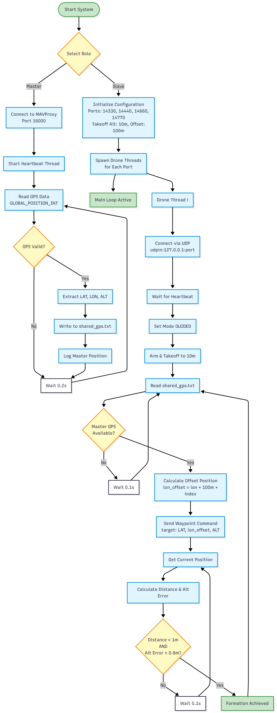

# Multi-UAV Formation Flight using MAVLink and ArduPilot SITL

## System Architecture

  
   
  <em>Click image to view full size</em>

## Introduction
This project demonstrates the implementation of **formation flight control** using multiple simulated drones in **ArduPilot SITL (Software-In-The-Loop)**.  
Three virtual UAVs—one *master* and two *slaves*—are launched in separate instances of SITL, each with a unique MAVLink system ID.  
The goal is to enable the master drone to act as the lead, with slave drones following in formation through synchronized command relay and telemetry sharing via **MAVLink** and **pymavlink**.  
This architecture provides a foundation for scalable multi-agent UAV swarm control used in research, surveillance, and autonomous operations.

---

## Principle of Operation
The formation control system follows a **master–slave synchronization principle** using the **MAVLink protocol**.  
Each UAV runs a separate SITL instance of the ArduCopter firmware. The master UAV transmits its telemetry data, while slave UAVs maintain relative positioning by receiving and replicating key state information such as attitude, position, and velocity.  
Communication between drones occurs via **UDP ports**, managed through **MAVProxy** and **pymavlink** for telemetry forwarding and control automation.

---

## Working

### Step 1 – Simulation Setup
Each drone instance is launched through `sim_vehicle.py`, assigning unique **instance IDs** and **system IDs**, along with separate UDP endpoints for MAVProxy (visualization) and pymavlink (API control).

| Drone | SYSID | MAVProxy Port | pymavlink Port |
|--------|--------|---------------|----------------|
| Master | 1 | 14550 | 14560 |
| Slave 1 | 2 | 14551 | 14561 |
| Slave 2 | 3 | 14552 | 14562 |

---

---

## Tools and Technologies
| Tool | Function |
|------|-----------|
| **ArduPilot SITL** | Simulates multiple drone instances in a virtual environment |
| **MAVProxy** | Acts as the ground control station (GCS) and message router |
| **pymavlink** | Provides Python API for MAVLink protocol-level control |
| **Python 3** | Used to implement automation and formation logic |
| **UDP Ports** | Enables dedicated communication channels for each UAV instance |

---

## Applications
- **Swarm Robotics** – Multi-UAV coordination for mapping, search, and surveillance missions.  
- **Formation Control Research** – Study of distributed UAV communication, offsets, and synchronization.  
- **Autonomous Systems Education** – Demonstrates MAVLink-level inter-UAV communication and control.  
- **Simulation Testing** – Enables debugging and validation of multi-drone algorithms before real-world deployment.  

---

## Advantages
- **Fully Virtual Environment** – Safe, cost-free experimentation without physical hardware.  
- **Highly Scalable** – New UAVs can be added by simply incrementing system IDs and ports.  
- **Protocol-Level Understanding** – Direct use of MAVLink messages deepens knowledge of UAV communication.  
- **Automation Compatible** – Can integrate AI or trajectory planning for coordinated maneuvers.  
- **Research-Grade Platform** – Realistic UAV network behavior for academic or industrial research.  

---

## Summary
This project demonstrates the foundation of a **multi-UAV formation control system** using ArduPilot SITL, MAVProxy, and pymavlink.  
Three simulated drones—one master and two slaves—communicate through UDP endpoints, managed and automated via Python scripts.  
The first phase establishes synchronized arming and telemetry verification across all UAVs.  
Future stages will expand this setup into full **formation maintenance and coordinated flight**, contributing to swarm robotics and cooperative UAV control research.

---

## Future Improvements
- Implement real-time position broadcast from master to slaves.  
- Add PID-based distance and velocity control for stable formation.  
- Integrate obstacle avoidance using LiDAR or rangefinders.  
- Extend to dynamic formations (V-shape, grid) with N-drone scalability.  
- Transition to Hardware-in-the-Loop (HIL) or real UAV implementation.

---

## Tech Stack Summary
| Category | Tools/Components |
|-----------|------------------|
| **Simulation** | ArduPilot SITL, MAVProxy |
| **Control Interface** | pymavlink (Python) |
| **Programming Language** | Python 3 |
| **Communication** | UDP (MAVLink Telemetry) |
| **Environment** | Linux / Ubuntu |
| **Output** | MAVProxy Consoles, SITL Windows, Terminal Logs |

---

## Author
**Rishabh Singh Rawat**  
B.Tech Electronics Engineering (IoT)  
JC Bose Institute of Technology, YMCA  
Intern @ BotLab Dynamics | Ahuja Radios  

